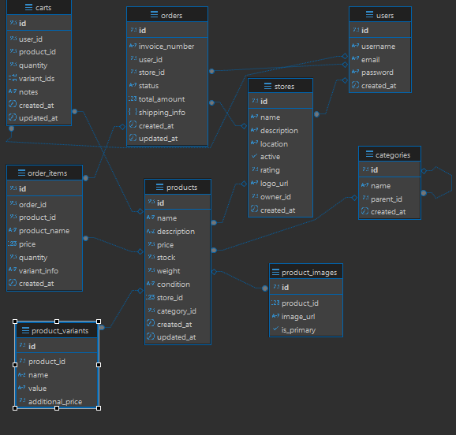

#E-commerce-Magang-TabelData

<h3>Knowledge Base</h3>

1. Apa yang anda ketahui tentang Rest API?
2. Apa yang anda ketahui tentang Server side and Client side processing?
3. Apa yang anda ketahui tentang Monolith dan Microservices, berikan contohnya?
4. Apa yang anda ketahui tentang Design pattern inversion of Control serta Dependency Injection?
5. Apa yang anda ketahui tentang Java programming dan Spring framework khususnya spring-boot?

<h3>Jawab</h3>
1. Rest API adalah antarmuka berbasis HTTP yang menggunakan metode seperti GET, POST, PUT, DELETE untuk pertukaran data antara client dan server, biasanya berbentuk format JSON atau XML, dengan struktur URL yang terorganisir

2. Server side terjadi ketika logika atau permintaan diproses di server, sementara client side yang diproses disisi client seperti browser untuk interaksi dinamis.

3. Monolith adalah arsitektur tunggal yang dimana semua modul (UI, logika, database) digabung dalam satu aplikasi, contohnya ecommerce tokopedia sederhana yang dibuat seperti di Repository ini cukup dengan 1 bahasa pemrograman dan 1 database saja. Sedangkan Microservice memisahkan semua fungsionalitas ke layanan independen contoh layanan pembayaran, produk, dan pengiriman di gojek yang bahkan bisa lebih dari 1 bahasa pemrogramana juga lebih dari 1 database yang digunakan. 

4. Inversion of Control adalah prinsip yang dimana kontrol alur program diserahkan ke framework. sementara Dependency Injection adalah implementasi IoC dengan menyediakan dependensi atau kebutuhan program secara otomatis.

5.. Java adalah bahasa pemrograman berorientasi objek yang multiplatform, sementara spring boot adalah framework Java yang menyederhanakan pengembangan aplikasi, juga cocok untuk membangun REST API atau aplikasi monolith/microservice, juga aplikasi website.

<h3>Desain Database</h3>

 

Desain database ini dirancang untuk mendukung kebutuhan dasar sistem e-commerce seperti yang terlihat pada contoh Tokopedia.

<h3>Alasan Memilih design arsitektur Monolith</h3>

1. Kesederhanaan dengan menggabungkan semua modul (seperti manajemen produk, keranjang belanja, dan pemrosesan order) dalam satu aplikasi Spring Boot, pengembangan dan testing menjadi lebih mudah.
2. Efisiensi untuk Skala Kecil, terutama untuk proyek dengan skala kecil hingga menengah, monolith lebih efisien karena tidak memerlukan kompleksitas tambahan.

<h4>Kelebihan Desain Ini</h4>

1. Mudah Dikembangkan: Spring Boot menyederhanakan pengembangan dengan konfigurasi otomatis dan embedded server.

2.Cepat Dideploy: Hanya perlu menjalankan satu aplikasi, tanpa perlu mengelola banyak service terpisah.

